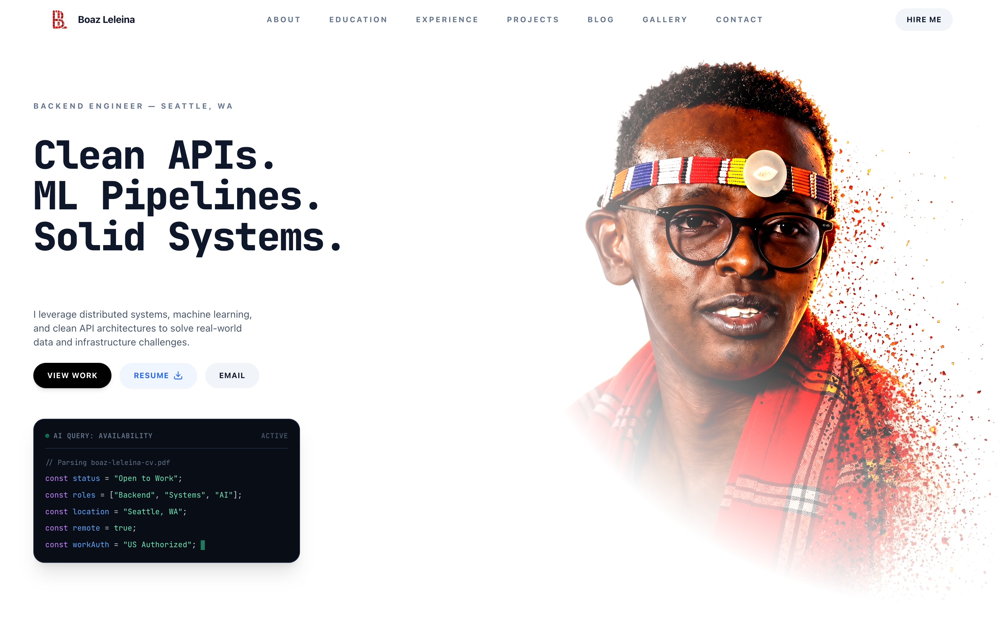
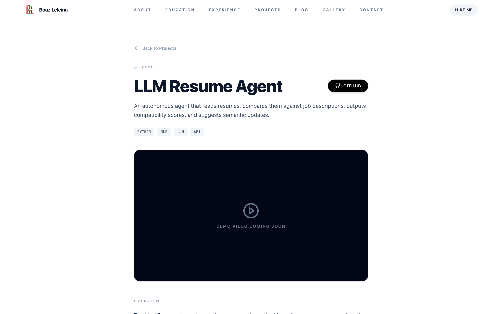
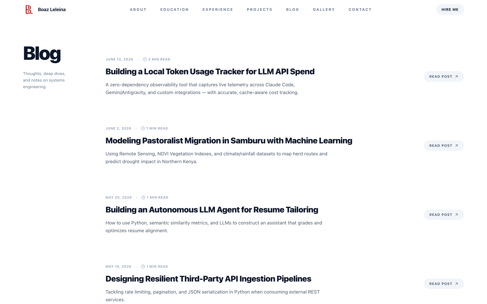
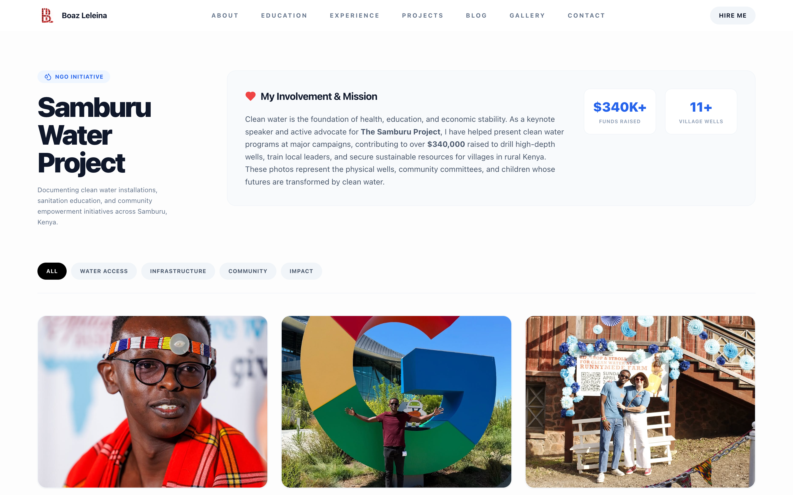
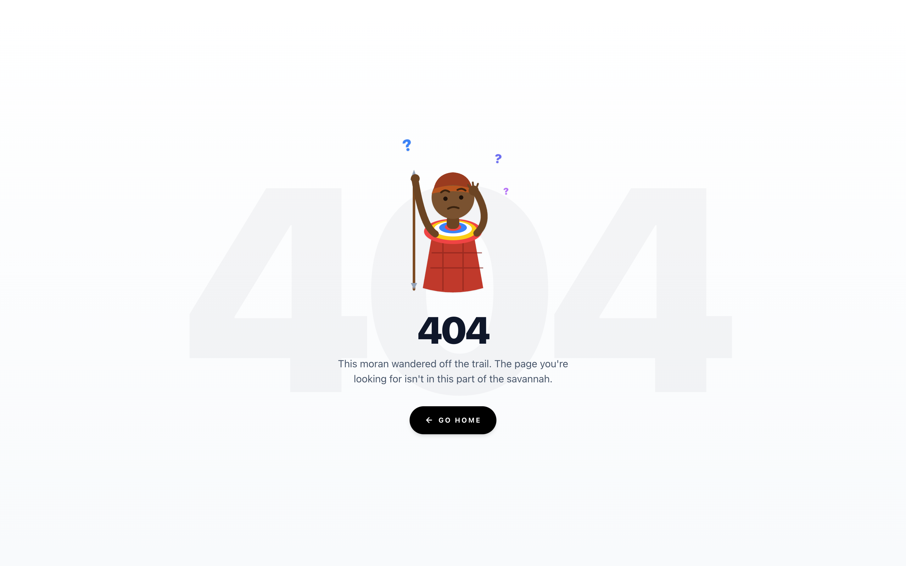

# Boaz Leleina — Portfolio

A personal portfolio site for a distributed-systems & backend engineer. Built as a fully static [Next.js 14](https://nextjs.org/) export with a 3D particle hero, animated transitions, a markdown-driven blog, a project showcase, and an image gallery.

> **Distributed systems · ML pipelines · clean backend architecture** — Seattle, WA.

<p align="center">
  
</p>

---

## ✨ Features

- **3D particle hero** — interactive `three.js` / `@react-three/fiber` portrait that resolves from a particle cloud.
- **Run-once typewriter** — animated skill descriptors on load (no loop).
- **Markdown blog** — posts authored as `content/blog/*.md`, parsed with `gray-matter`, rendered via `react-markdown` + `remark-gfm` + `rehype-highlight`, with auto-computed read time.
- **Project showcase** — per-project detail pages driven by a typed data source (`src/data/projects.ts`), with overview, "why it matters", tech stack, and demo-video slots.
- **Image gallery** — filterable gallery documenting the Samburu Water Project NGO work.
- **Animated 404** — a custom illustrated not-found page.
- **Dark / light themes** — `next-themes` with system preference support.
- **Fully responsive** — tuned for mobile, tablet, iPad, and Surface Pro breakpoints with a hamburger nav under `lg`.
- **GSAP** scroll and entrance animations throughout.
- **Static export** — `output: 'export'` emits a zero-runtime `./out` site servable from any CDN (Cloudflare Pages).

## 🖼️ Screenshots

| Projects | Blog |
| --- | --- |
|  |  |

| Gallery | 404 |
| --- | --- |
|  |  |

## 🛠️ Tech Stack

| Layer | Tools |
| --- | --- |
| Framework | Next.js 14 (App Router, static export) · React 18 · TypeScript |
| Styling | Tailwind CSS · `@tailwindcss/typography` · `tailwind-merge` · `clsx` |
| 3D / Motion | `three` · `@react-three/fiber` · `@react-three/drei` · GSAP |
| Content | Markdown · `gray-matter` · `react-markdown` · `remark-gfm` · `rehype-highlight` |
| Theming / Icons | `next-themes` · `lucide-react` |
| Deploy | Cloudflare Pages (static `./out`) |

## 🚀 Getting Started

```bash
# install dependencies
npm install

# run the dev server at http://localhost:3000
npm run dev

# build the static site to ./out
npm run build
```

## 📁 Project Structure

```
src/
├── app/                # App Router pages
│   ├── page.tsx        # home (hero, about, experience, projects, contact)
│   ├── blog/           # blog index + [slug] post pages
│   ├── projects/       # project [slug] detail pages
│   ├── gallery/        # image gallery
│   └── not-found.tsx   # animated 404
├── components/         # Navbar, ParticleSystem, Experience, Overlay, …
├── data/projects.ts    # typed project showcase data
└── lib/blog.ts         # markdown loader + read-time calc
content/blog/           # blog posts (*.md)
public/                 # portrait, resume, gallery images
docs/screenshots/       # README screenshots
```

## ✍️ Authoring a Blog Post

Drop a markdown file in `content/blog/` with frontmatter:

```markdown
---
title: Building a Local Token Usage Tracker for LLM API Spend
description: A zero-dependency observability tool for LLM API spend.
date: 2026-06-13
category: Observability
---

Post body in markdown…
```

Read time is computed automatically (~200 wpm) unless a `readTime` field is supplied.

## 📬 Contact

- **Email** — [boazleleina3@gmail.com](mailto:boazleleina3@gmail.com)
- **GitHub** — [@boazleleina](https://github.com/boazleleina)
- **LinkedIn** — [boaz-leleina](https://linkedin.com/in/boaz-leleina)
